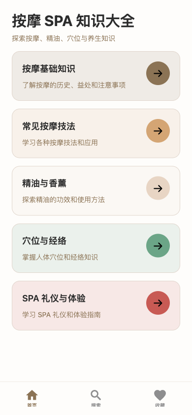
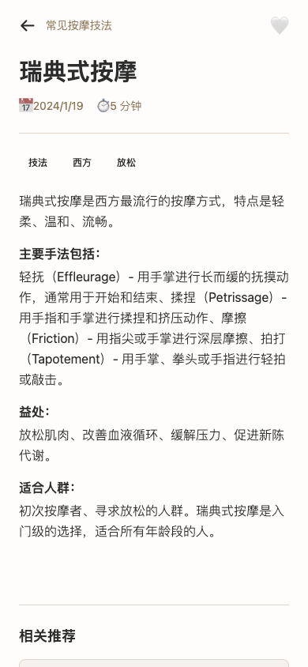
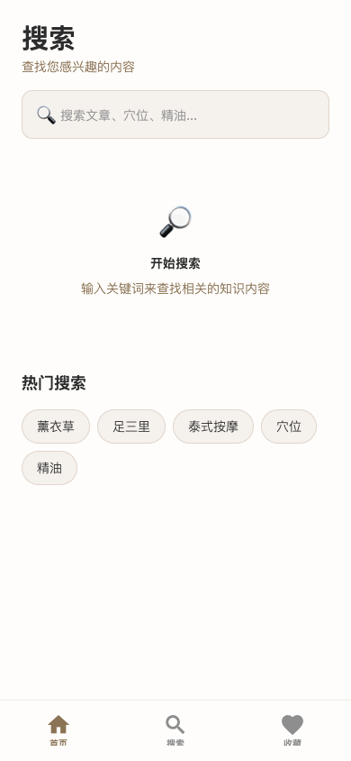

# 按摩 SPA 知识大全

A comprehensive massage and SPA knowledge encyclopedia app built with Expo + React Native, deployed on Vercel with Supabase PostgreSQL.

**Live**: https://massagespaguide.vercel.app

## Screenshots

<p align="center">
  
  
  
  
</p>

## Features

### Content
- **30 knowledge articles** across 6 categories
  - 按摩基础知识 (Basics)
  - 常见按摩技法 (Techniques)
  - 精油与香薰 (Essential Oils)
  - 穴位与经络 (Acupoints)
  - SPA 礼仪与体验 (SPA Etiquette)
  - **男士按摩指南** (Men's Health) - NEW!

### Interactive Tools
- **症状速配** (Symptom Match) - 3-step massage recommendation based on symptoms
- **穴位计时器** (Acupoint Timer) - Guided massage with rhythm and timing
- **每日挑战** (Daily Challenge) - 30-day wellness challenge with streak tracking
- **AI 顾问** (AI Advisor) - Intelligent Q&A for massage and wellness
- **知识问答** (Knowledge Quiz) - Interactive quiz to test your knowledge

### Core Features
- Full-text search with hot search tags
- Favorites with local persistence (AsyncStorage)
- Responsive layout (mobile, tablet, desktop)
- Dark mode support
- Sub-heading detection for structured content rendering
- Related article recommendations

## Tech Stack

| Layer | Technology |
|---|---|
| Frontend | Expo 54 + React Native + TypeScript |
| Styling | NativeWind (Tailwind CSS for RN) |
| Routing | Expo Router (file-based) |
| Backend | Express + tRPC v11 |
| Database | Supabase PostgreSQL + Drizzle ORM |
| Deployment | Vercel (static + serverless) |

## Getting Started

```bash
cd massage_spa_guide
pnpm install
pnpm dev
```

## Project Structure

```
massage_spa_guide/
  app/                    # Expo Router screens
    (tabs)/               # Bottom tab navigation
      index.tsx           # Home with tools & categories
      search.tsx          # Full-text search
      advisor.tsx         # AI chat advisor
      favorites.tsx       # Saved articles
    category/[id]         # Category listing
    knowledge/[id]        # Article detail
    tools/                # Interactive tools
      symptom-match.tsx   # Symptom-based recommendations
      acupoint-timer.tsx  # Guided massage timer
      daily-challenge.tsx # Daily wellness challenge
      challenge-stats.tsx # Challenge statistics
      mens-guide.tsx      # Men's health guide (NEW)
      mens-quiz.tsx       # Knowledge quiz (NEW)
  api/                    # Vercel serverless entry point
  data/                   # Static knowledge content (JSON)
    knowledge.json        # All articles & categories
    symptom-matrix.json   # Symptom matching rules
    routines.json         # Massage routines
    challenges.json       # Daily challenges
  server/                 # Express + tRPC backend
  drizzle/                # Database schema & migrations
  components/             # Reusable UI components
  lib/                    # Client utilities (tRPC, theme)
  hooks/                  # React hooks
```

## Deployment

The app is deployed on Vercel with the following setup:

- **Frontend**: Expo web export (`npx expo export --platform web`) served as static files
- **API**: Express app as Vercel serverless function via `api/index.ts`
- **Database**: Supabase PostgreSQL (table: `spa_users`)

### Environment Variables

| Variable | Description |
|---|---|
| `DATABASE_URL` | Supabase PostgreSQL connection string |
| `JWT_SECRET` | Session signing key |
| `EXPO_PUBLIC_API_BASE_URL` | Optional (leave empty for same-origin) |

## License

MIT
